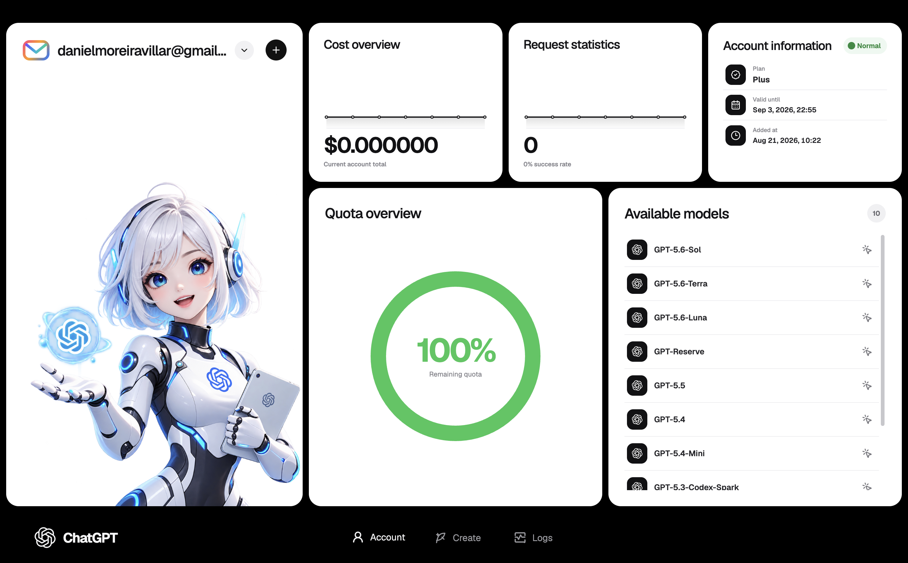
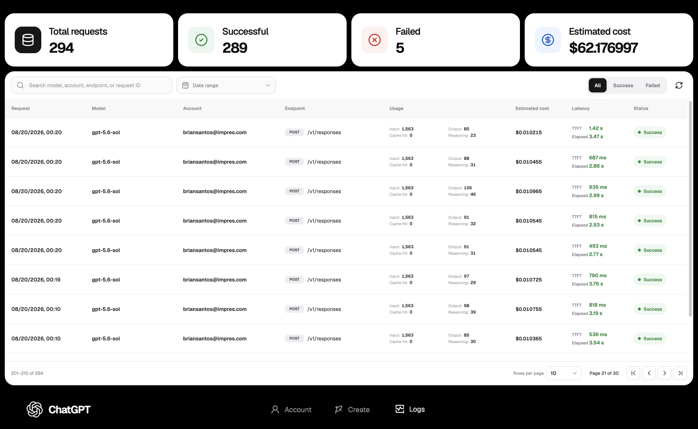

# StarBox

[English](./README.md) | [简体中文](./README.zh-CN.md)

StarBox is a locally run desktop application for managing ChatGPT and Codex accounts on Windows and macOS.

Use StarBox to manage multiple accounts, view quotas and available models, track requests and token usage, call models through a local gateway, and create images. Account credentials, usage records, and generated content are stored locally on your device.

## User Guide

[View the StarBox User Guide](https://rcnavw2rdmby.feishu.cn/wiki/MkwFwO2bjiJQF6kJ9tZcaNJanud?from=from_copylink)

## Interface Preview





## Download

[Download the latest version of StarBox](https://github.com/solnsu/StarBox/releases/latest)

- Windows: 64-bit systems
- macOS: Apple Silicon and Intel processors

## Open Source

StarBox source code is licensed under the [Apache License 2.0](./LICENSE). The license permits use, modification, distribution, and commercial use on Linux, Windows, macOS, and other platforms, subject to its terms.

The StarBox name, logo, and official release identifiers may not be used to imply endorsement or official status. See [NOTICE](./NOTICE) for attribution and branding information and [CONTRIBUTING.md](./CONTRIBUTING.md) to contribute.

## Build from Source

Node.js 22 and a separately installed [OpenAI Codex CLI](https://github.com/openai/codex) are recommended.

```bash
npm ci
npm test
npm run build
```

## Acknowledgements

StarBox is built with the help of excellent open-source projects and technologies. See [Acknowledgements](./ACKNOWLEDGEMENTS.md) and [Third-Party Notices](./THIRD_PARTY_NOTICES.md) for details.

## Community Acknowledgements

Thanks to the [Linux.do](https://linux.do/) community for promoting the project and providing valuable feedback and support.

## Legal, Privacy, and Security

- [End User License Agreement (Bilingual)](./EULA.txt)
- [End User License Agreement (English)](./EULA_EN.txt)
- [Privacy Policy](./PRIVACY.md)
- [Security Policy and Vulnerability Reporting](./SECURITY.md)

StarBox is an independent project and is not affiliated with, endorsed by, or sponsored by OpenAI. OpenAI, ChatGPT, and Codex are trademarks of their respective owners.
